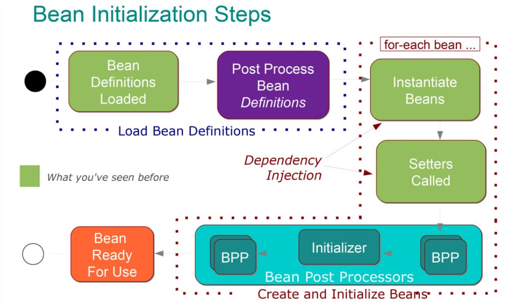

Демо приложение для демонстрации скоупов бинов и жизненного цикла
В пакете scope представлены классы для демонстрации:

- Объявление разных скоупов
- Внедрение prototype в singleton

Демонстрация работы - в тестах

В пакете initialization представлен жизненный цикл бина с постпроцессорами и пояснениями, что для чего нужно

